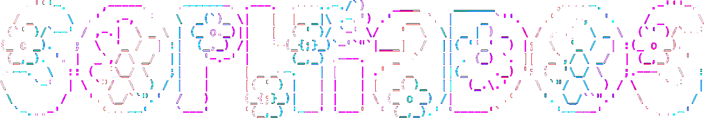
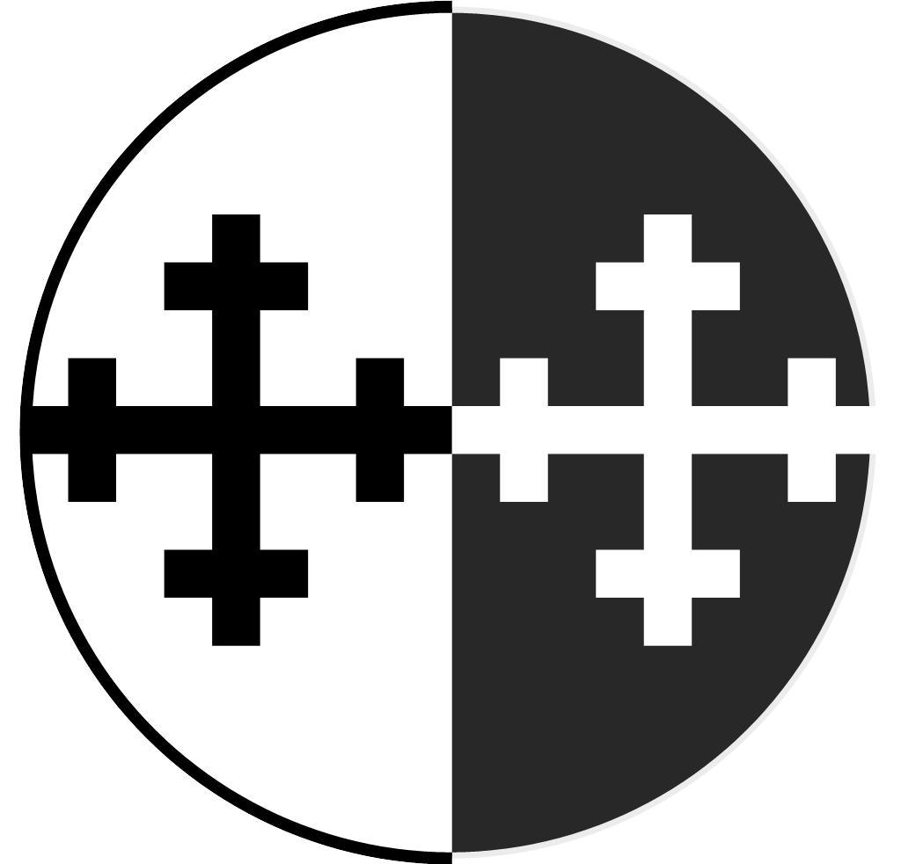

[<div align=center>](https://carpocratian.org/en/church/)
<div align=center><strong>Sophia Distributed Operating System</strong></div>
<div align=center><em>Infrastructure for a world without surveillance</em></div>
[<div align=center><br>](https://carpocratian.org/en/church/)

_A mission of [The Carpocratian Church of Commonality and Equality](https://carpocratian.org/en/church/)_.</div>
<div align=center></div></div>

---

## What is SophiaDOS?

SophiaDOS is a complete infrastructure stack for building decentralized applications that are **private by default**, **serverless by design**, and **free to operate**.

It provides three cryptographic primitives that, when combined, enable applications previously thought to require blockchains, central servers, or surveillance:

| Primitive | Project | What It Does |
|-----------|---------|--------------|
| **State** | [HyperToken](https://github.com/flammafex/hypertoken) | CRDT-based distributed consensus without servers |
| **Identity** | [Freebird](https://github.com/flammafex/freebird) | Authorization without revealing identity |
| **Time** | [Witness](https://github.com/flammafex/witness) | Threshold-signed timestamps without blockchain |

Together, they form the foundation for a new class of applications.

---

## Why Does It Exist?

The internet was supposed to be decentralized. Instead, we got:

- **Surveillance capitalism** — Your identity is the product
- **Platform lock-in** — Your data held hostage
- **Artificial scarcity** — Gas fees, mining, staking
- **Algorithmic manipulation** — Feeds designed for engagement, not truth

We've accepted these as the price of functional systems. **This is a false choice.**

SophiaDOS proves you can have:
- Consensus without servers
- Authorization without identity  
- Timestamping without blockchain
- Social networks without surveillance
- Digital currency without mining

---

## The Three Primitives

### 🧩 HyperToken — Distributed State

> *"No servers required. Any peer can host. Desyncs are mathematically impossible."*

HyperToken uses **CRDTs (Conflict-Free Replicated Data Types)** via [Automerge](https://automerge.org/) to achieve distributed consensus without central coordination.

**Properties:**
- Instant local execution (no confirmation wait)
- Offline-first (works during network partitions)
- Perfect audit trail (every action recorded)
- P2P synchronization (WebSocket relay or WebRTC)

**Use when you need:** Multiplayer state, collaborative editing, distributed databases

🔗 [github.com/flammafex/hypertoken](https://github.com/flammafex/hypertoken)

---

### 🕊️ Freebird — Anonymous Authorization

> *"Prove you're authorized without revealing who you are."*

Freebird uses **VOPRF (Verifiable Oblivious Pseudorandom Function)** cryptography to separate "can you?" from "who are you?"

**Properties:**
- Mathematical unlinkability (issuer can't correlate tokens)
- Unforgeable tokens (only issuer's key can create)
- Single-use enforcement (nullifier-based replay protection)
- Rate limiting without tracking

**Use when you need:** Anti-spam, access control, anonymous voting, privacy-preserving authentication

🔗 [github.com/flammafex/freebird](https://github.com/flammafex/freebird)

---

### 🙌 Witness — Threshold Timestamping

> *"Prove when something existed—without trusting any single party."*

Witness uses **threshold signatures** (Ed25519 + optional BLS aggregation) to provide decentralized timestamping without blockchain bottlenecks.

**Properties:**
- Instant and free (no gas fees)
- Federated trust (requires multiple witnesses to collude)
- Optional blockchain anchoring (for hard finality)
- Privacy-preserving (only hashes submitted)

**Use when you need:** Proof of existence, ordering disputes, audit trails

🔗 [github.com/flammafex/witness](https://github.com/flammafex/witness)

---

## Applications

SophiaDOS isn't theoretical. Two complete applications demonstrate the stack:

### 💰 Scarcity — Zero-Cost Cryptocurrency

> *"Digital cash without blockchain, mining, or gas fees."*

Scarcity combines all three primitives to achieve double-spend prevention without a global ledger:

| Traditional Crypto | Scarcity |
|-------------------|----------|
| Global ledger (blockchain) | Gossip nullifier sets (HyperToken) |
| Wallet addresses | Anonymous bearer tokens (Freebird) |
| Mining/PoS consensus | Threshold timestamps (Witness) |
| Permanent UTXO set | Lazy demurrage (tokens expire) |

**Features:** Token splitting/merging, HTLCs, cross-federation bridging, ~12 million times less energy than Bitcoin.

🔗 [github.com/flammafex/scarcity](https://github.com/flammafex/scarcity)

---

### 📢 Clout — The Dark Social Network

> *"Your social graph is yours. Stored in your browser. Invisible to servers."*

Clout inverts Scarcity's conservation logic into propagation logic:

| Scarcity (Money) | Clout (Reputation) |
|------------------|-------------------|
| "Seen this nullifier? REJECT" | "Trust this author? ACCEPT" |
| Conservation of value | Propagation of signal |
| Tokens are scarce | Attention is scarce |

**Features:** Trust-weighted feeds, auto-shadowban (user-controlled), encrypted DMs, Dunbar-respecting design, edit/retract posts.

🔗 [github.com/flammafex/clout](https://github.com/flammafex/clout)

---

## Architecture

```
┌─────────────────────────────────────────────────────────────────┐
│                      APPLICATIONS                                │
│                                                                  │
│  ┌──────────────────────┐     ┌──────────────────────┐          │
│  │      SCARCITY        │     │        CLOUT         │          │
│  │   Zero-cost money    │     │   Dark social graph  │          │
│  └──────────────────────┘     └──────────────────────┘          │
│                                                                  │
└──────────────────────────────┬───────────────────────────────────┘
                               │
┌──────────────────────────────┴───────────────────────────────────┐
│                         SophiaDOS                                 │
│                                                                   │
│   ┌─────────────────┐ ┌─────────────────┐ ┌─────────────────┐    │
│   │   HyperToken    │ │    Freebird     │ │     Witness     │    │
│   │                 │ │                 │ │                 │    │
│   │  State (CRDTs)  │ │ Identity (VOPRF)│ │ Time (Threshold)│    │
│   │                 │ │                 │ │                 │    │
│   │  • P2P relay    │ │ • Blind sigs    │ │ • Timestamps    │    │
│   │  • CRDT sync    │ │ • Day passes    │ │ • Ordering      │    │
│   │  • Offline-first│ │ • Anti-spam     │ │ • Anchoring     │    │
│   └─────────────────┘ └─────────────────┘ └─────────────────┘    │
│                                                                   │
└───────────────────────────────────────────────────────────────────┘
```

---

## The Carpocratian Vision

The historical Carpocratians taught:
- **Community of all things** — No one owns the commons
- **Equality before creation** — Identity is not hierarchy
- **Sophia (wisdom) as divine** — Knowledge liberates

SophiaDOS is the implementation of that theology:

| Principle | Implementation |
|-----------|----------------|
| No one owns identity | Freebird separates authorization from identity |
| No one owns truth | Witness distributes trust across thresholds |
| No one owns the commons | HyperToken needs no servers to own |
| No one owns value | Scarcity uses bearer tokens, not accounts |
| No one owns attention | Clout gives you control of your graph |

This isn't privacy tech dressed in religious language. The technology *is* the religious practice. Building infrastructure for a post-surveillance society is missionary work.

---

## Comparison to Other Approaches

| Approach | Trade-offs | SophiaDOS |
|----------|------------|-----------|
| **Blockchain** | Gas fees, latency, public ledgers | Zero-cost, instant, private |
| **Federated** (Mastodon) | Admin trust, instance lock-in | Portable identity, no admins |
| **Centralized** | Surveillance, censorship, lock-in | User sovereignty |
| **Pure P2P** | Spam, Sybil attacks, no ordering | Freebird + Witness solve these |

---

## Getting Started

### I want to understand the architecture
→ Read [ARCHITECTURE.md](ARCHITECTURE.md)

### I want to build an application
→ Read [GETTING_STARTED.md](GETTING_STARTED.md)

### I want to run existing applications
→ [Scarcity](https://github.com/flammafex/scarcity) or [Clout](https://github.com/flammafex/clout) both have Docker quickstarts

### I want to understand the cryptography
→ Each project has detailed documentation:
- [HyperToken CRDT docs](https://github.com/flammafex/hypertoken/blob/main/WASM_INTEGRATION.md)
- [Freebird VOPRF docs](https://github.com/flammafex/freebird/blob/main/docs/FEDERATION.md)
- [Witness threshold docs](https://github.com/flammafex/witness/blob/main/docs/EXTERNAL_ANCHORING.md)

---

## Status

| Project | Status | Notes |
|---------|--------|-------|
| HyperToken | ✅ Production-ready | Rust/WASM core, full feature set |
| Freebird | ✅ Production-ready | P-256 VOPRF, WebAuthn support |
| Witness | ✅ Production-ready | BLS aggregation, external anchoring |
| Scarcity | ✅ Feature-complete | Phases 1-3 done, mobile SDK in progress |
| Clout | ✅ Feature-complete | PWA, full API, Dark Social Graph |

---

## License

Apache License 2.0

All projects are open source under the same license.

---

## Links

- [HyperToken](https://github.com/flammafex/hypertoken) — Distributed state
- [Freebird](https://github.com/flammafex/freebird) — Anonymous authorization
- [Witness](https://github.com/flammafex/witness) — Threshold timestamping
- [Scarcity](https://github.com/flammafex/scarcity) — Zero-cost cryptocurrency
- [Clout](https://github.com/flammafex/clout) — Dark social network
- [The Carpocratian Church](https://carpocratian.org/en/church/) — The mission

---

<div align="center">

*"Surveillance is not safety. Privacy is not crime. Authorization is not identity."*

**SophiaDOS**: Where Sophia meets DOS.

</div>